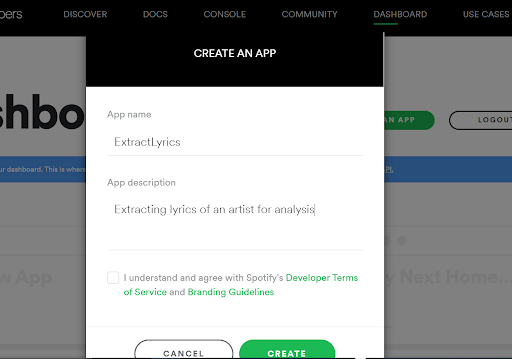
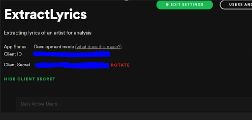
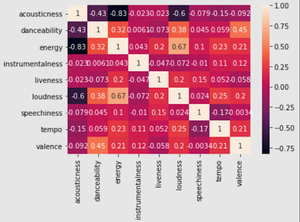
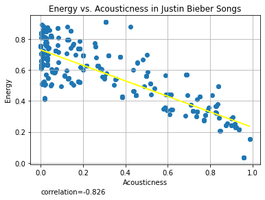
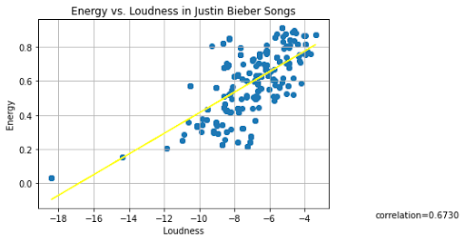
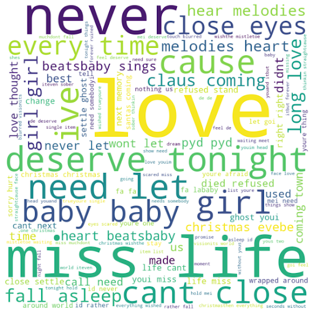
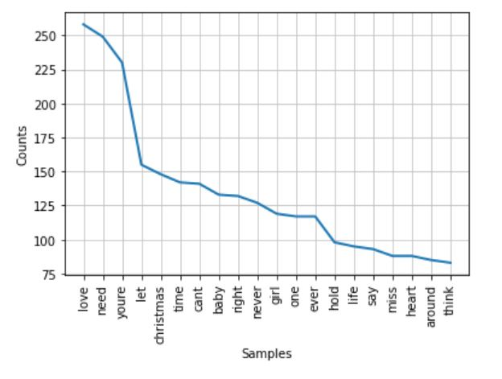
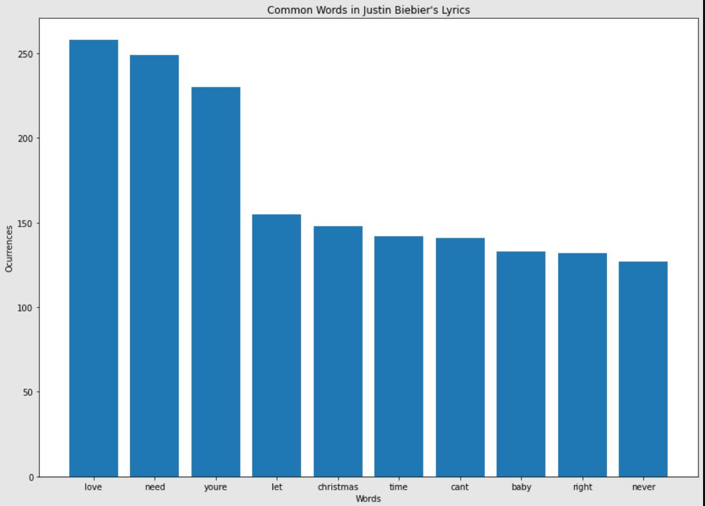

# Lyrics Analysis of favourite Spotify Artist
 Extract the lyrics from the songs of your favourite artist and analyse the commonly occuring words from Spotify.

Let’s break this down into smaller problems. We have to get the lyrics from our favourite artist. I have decided to go with Justin Bieber. 
Step 1: Connect to spotify
Step 2: Search all the albums for Justin Bieber
Step 3: Get the tracks from all Justin Bieber albums
Step 4: Get the lyrics of all the extracted tracks

Sounds easy, right? Now, how do we connect to Spotify? We use Spotipy.
## What is Spotipy?
Spotipy is a Spotify API for Python. It gives you access to all music data provided by the Spotify platform. 
First, we install spotipy.

pip install spotipy --upgrade

Connect to Spotify

In order to access all the data, you need a Spotify developer account. You can create one by simply signing in with your spotify account. Here’s the link to the page: https://developer.spotify.com/. You do not need a spotify premium for this. You have to register your app to get the credentials required for authorization.
In your developer account go to your dashboard and choose “create an app”. Fill in your app name and app description and  click create. Now you get access to a public key and private key.

Now you get the client ID and client secret for this app.

Both these are required to authenticate with the spotify web API. We authenticate without signing into the Spotify account. There are various ways to authenticate. You can read more about this in the Spotipy documentation here: https://spotipy.readthedocs.io/en/2.6.1/

Next we create a spotify object to interact with the Spotify API.

client_credentials_manager = SpotifyClientCredentials(client_id=client_id, client_secret=client_secret)
sp = spotipy.Spotify(client_credentials_manager=client_credentials_manager) .

Now, we can interact with the API.

## Extracting lyrics
### Fetch all albums by artist name
The next step is data querying. sp.search() method is used to search for specific items. We need all the albums by a specific artist.
### Get tracks from all albums
Extract the artist uri from the result and then using the sp.artist_albums() method pull all of the artist albums.
Using the album uris, extract all the tracks within the album.
#### Get track features
For each of the tracks extracted, we collect the audio features such as acousticness,danceability, energy, instrumentalness, liveness, speechiness, tempo, valence and popularity. Each of the track features are stored in a dictionary. This dictionary is the used to create a dataframe.
### Get lyrics of all the tracks
The lyrics are extracted from the website ‘Genius.com’. We use ‘Beautiful Soup’ for web scraping. Beautiful Soup is a python library for pulling data out of HTML or XML files. We define a function named create_lyrics() in order to scrape the lyrics from genius. The lyrics are then added to the dataframe with the track details.

Now, you know how to extract the lyrics from all the songs of your favourite artist.

## Data Visualisation
### Correlation among track features
We create a correlation heatmap among the track features using seaborn.

We observe that acousticness and energy are negatively correlated. We plot these 2 features separately to show their relationship.

Acoustic music lacks electrical amplification and is mostly gentle. Energy on the other hand represents intensity and activity. Energetic tracks are usually fast, loud and noisy. The negative correlation indicates that when energy is high, the acousticness is low and vice versa. This makes sense based on the definition.

We also plot 2 other features, energy and loudness. There is a very high correlation between these two features. 

Energetic songs tend to be louder and this relationship checks out as per the definition.

## Data Cleaning
We create a new data frame with the song name and extracted lyrics alone. In the dataframe, we can see that lyrics are not available for some songs. We remove them from further analysis.
### Remove newline characters, punctuations and texts in [ ]
We use regular expression to remove punctuations, newline characters and texts in [ ] like [Verse1] as these do not add any meaning to the analysis.

### Tokenization
Tokenization is the process of splitting long sentences into individual tokens/words.
We use the word_tokenize() function from nltk to tokenize the cleaned lyrics.

### Stopword removal
It is a commonly used data preprocessing step in NLP. It simply removes the most commonly used words in the corpus. For example, pronouns and articles are considered to be stopwords. 
NLTK provides a list of stopwords in english. We use this to further clean our lyrics.

As we are analysing song lyrics, there might be other meaningless words like yeah, gonna, wanna etc…. These were then removed separately.

## Generating word cloud
The total number of words and number of unique words in Justin Bieber lyrics were calculated. It was observed that our dataset contained a total of 17668 words, among them we have 3116 unique words.
We then generate a word cloud. Word cloud is a data visualisation technique in which the size of the word indicates its frequency or importance. We use the wordcloud package to create the wordcloud.

## Frequency Distribution
We plot a frequency distribution graph for the commonly occurring 20 words.

The bar graph below represents the most commonly occurring 10 words.

You can also find similar analysis for Billie Elish in the repository.
